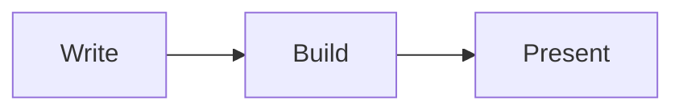

# Hugo PowerSlides

A full-featured Markdown presentation theme for Hugo: layouts, transitions, step-by-step reveals, presenter mode, PDF export, color themes, math, and diagrams.

**[See the demo](https://npellegrin.github.io/hugo-powerslides-demo/)** · [Changelog](CHANGELOG.md) · [Contributing](CONTRIBUTING.md)

- [Quick start](#quick-start)
- [Writing slides](#writing-slides)
- [Presenting](#presenting)
- [Several presentations on one site](#several-presentations-on-one-site)
- [Customizing](#customizing)
- [Reference](#reference)
- [Security](#security)
- [Troubleshooting](#troubleshooting)

## Quick start

You need [Hugo](https://gohugo.io/installation/) 0.123 or later (the standard edition is enough), plus Go and Git for Hugo Modules.

**1. Create a site and add the theme**

```bash
hugo new site my-talks && cd my-talks
hugo mod init github.com/me/my-talks
```

Replace the content of `hugo.toml` with:

```toml
title = "My talks"
languageCode = "en"

[module]
  [[module.imports]]
    path = "github.com/npellegrin/hugo-powerslides"

# Recommended: these settings cannot come from a theme, so they go in your site.
[markup.goldmark.renderer]
  unsafe = true              # allows HTML in slides
[markup.highlight]
  noClasses = false          # code colors follow the slide theme
```

```bash
hugo mod get github.com/npellegrin/hugo-powerslides@latest
```

**2. Write a presentation** in `content/hello.md`:

```markdown
---
title: "Hello"
description: "My first deck."
---



# Hello

## A first presentation

---

# Agenda

- Why
- How
- What next


Only visible in presenter mode.


---

# Thank you!
```

**3. Run it**

```bash
hugo server
```

Open <http://localhost:1313/hello/>, press <kbd>→</kbd> to move forward and <kbd>P</kbd> to open the presenter window. The home page lists your presentations.

To publish, run `hugo` and upload the `public/` folder to any static host. The site also works in a subfolder, such as `https://example.com/talks/`.

## Writing slides

### Slides

Separate slides with `---` on its own line, **with a blank line before it**:

```markdown
# First slide

Some text.

---

# Second slide
```

> Without the blank line, Markdown reads `---` as a heading underline and the two slides merge. Hugo prints a warning when this happens.

To draw a visible line inside a slide, use ``.

### Options for one slide

Put a `slide` shortcode at the top of a slide to set its options:

```markdown


# Agenda
```

The `id` gives the slide a stable link (`/hello/#agenda`). All options are listed in the [reference](#slide-options).

### Speaker notes

```markdown

Remind the audience about the survey.

```

Notes are hidden on the slide and shown in presenter mode.

### Layouts

A title slide:

```markdown


# Hugo PowerSlides

## Presentations in Markdown
```

A numbered part divider (numbers 01, 02… are added automatically):

```markdown


# Getting started

Everything you need for your first deck.
```

A big statement or quote:

```markdown


> Simplicity is prerequisite for reliability.

— Edsger W. Dijkstra
```

A full-screen image with a message:

```markdown


# Ship it.
```

An image next to the text (`image-left` or `image-right`):

```markdown


# Our team

- 12 people
- 4 countries
```

Give `alt` a description when the image carries meaning; leave it out when it is decorative.

### Backgrounds

```markdown



```

Background images are tinted with the theme's background color (75% by default) so that text stays readable. With a background color, pick a `theme` whose text matches it.

### Step-by-step reveals

Each list item appears on the next key press:

```markdown

- First point
- Second point
- Third point

```

Styles: `up` (default), `fade`, `zoom`, and `highlight`, which colors each item in turn:

```markdown

- Plan
- Build
- Ship

```

Any HTML element with the `fragment` class is also a step: `<p class="fragment">Surprise!</p>`.

To animate items as soon as the slide appears, without waiting for a key press, use the `anim-fade`, `anim-up`, `anim-zoom`, or `anim-slide` classes:

```html
<ul>
  <li class="anim-up">Appears first</li>
  <li class="anim-fade">Then this one</li>
</ul>
```

### Transitions

```markdown

```

| Style   | Transitions                                          |
| ------- | ---------------------------------------------------- |
| Subtle  | `fade` (default), `slide`, `up`, `zoom`, `blur`, `none` |
| Classic | `push`, `flip`, `wipe`, `iris`                       |
| Kitsch  | `spin`, `bounce`, `swing`, `tv`                      |

Set a default for a presentation with `transition: zoom` in its front matter, or for the whole site in `hugo.toml`. When the system asks for reduced motion, every transition becomes a short fade.

### Columns

```markdown


### Before

Manual slides.


### After

Markdown slides.


```

`count` can be 2, 3, or 4. Columns stack on phones.

### Figures and callouts

```markdown



Press **O** to see every slide at once.

```

Callout types: `note`, `tip`, `warning`. Each has its own icon, so they remain distinguishable without color.

### Tables, quotes, and more

Standard Markdown works and is styled for projection: tables (with column alignment), blockquotes, task lists, `<kbd>` keys, `<mark>` highlights, and footnotes, which appear at the bottom of the slide that cites them.

```markdown
| Plan  | Price |
| :---- | ----: |
| Free  |    0€ |
| Pro   |   10€ |

Press <kbd>Ctrl</kbd> <kbd>S</kbd> to <mark>save</mark>.[^1]

[^1]: Or use the menu.
```

### Code

````markdown
```js {hl_lines=[2]}
function next() {
  render(index + 1);
}
```
````

`hl_lines` highlights lines. Code colors follow the slide theme when `noClasses = false` is set (see [Quick start](#quick-start)); otherwise Hugo's `markup.highlight.style` applies.

### Math

```markdown
Euler's identity: \(e^{i\pi} + 1 = 0\)

$$
\int_0^1 x^2 \, dx = \frac{1}{3}
$$
```

Add this to `hugo.toml`, so that Markdown leaves the formulas untouched:

```toml
[markup.goldmark.extensions.passthrough]
  enable = true
  [markup.goldmark.extensions.passthrough.delimiters]
    block = [['\[', '\]'], ['$$', '$$']]
    inline = [['\(', '\)']]
```

KaTeX loads only on pages that contain math. Force it on or off with `math: true` or `math: false` in front matter.

### Diagrams

````markdown

````

Diagrams use the colors of their slide. Mermaid loads only on pages that contain one.

### Videos and embedded pages

```markdown



```

- Autoplay videos start muted when their slide appears and pause when you leave it.
- Embedded pages load only when their slide is current or next. Allow their site in the [security settings](#security): `frameSrc = ["https://www.youtube-nocookie.com"]`.

### Images and links

- `/images/photo.jpg` is the file `static/images/photo.jpg` of your site.
- `photo.jpg` is a file next to your Markdown file (with `content/hello/index.md` and `content/hello/photo.jpg`).
- Full URLs are used as they are.

Paths keep working when the site is published in a subfolder.

## Presenting

| Keys                                            | Action                                   |
| ----------------------------------------------- | ---------------------------------------- |
| <kbd>→</kbd> <kbd>↓</kbd> <kbd>Space</kbd> <kbd>Page Down</kbd> | Next step or slide       |
| <kbd>←</kbd> <kbd>↑</kbd> <kbd>Page Up</kbd>    | Previous step or slide                   |
| <kbd>Home</kbd> <kbd>End</kbd>                  | First or last slide                      |
| <kbd>1</kbd> <kbd>2</kbd> <kbd>Enter</kbd>      | Go to slide 12                           |
| <kbd>O</kbd> or <kbd>Esc</kbd>                  | Overview of all slides                   |
| <kbd>F</kbd>                                    | Fullscreen                               |
| <kbd>P</kbd>                                    | Presenter window                         |

- **Clickers** work out of the box: most send Page Up and Page Down.
- **Touch screens**: swipe left or right.
- **Same look everywhere**: slides are drawn at 1920×1080 and scaled to the screen, so what you see on your laptop is what the projector shows.

### Presenter mode

Press <kbd>P</kbd> to open a second window, and put it on your own screen while the first one goes to the projector. It shows:

- the current slide, with the steps still to come faded;
- the next slide;
- your notes;
- the elapsed time (with pause and reset) and the clock.

Both windows stay in sync, whichever one you use to navigate.

### PDF export

Open the presentation, print it (<kbd>Ctrl</kbd> <kbd>P</kbd> or <kbd>⌘</kbd> <kbd>P</kbd>), and choose **Save as PDF**. You get one page per slide, with every step visible. Enable **Background graphics** if the dialog offers it. Chrome and Edge give the best result.

## Several presentations on one site

```text
content/
├── _index.md              → home page: lists everything below
├── intro-to-hugo.md       → a presentation
└── conferences/
    ├── _index.md          → lists the presentations of this section
    ├── devfest-2026.md
    └── meetup/
        ├── index.md       → a presentation with its own images
        └── diagram.png
```

List pages show each presentation's `title`, `description`, `date`, and number of slides:

```markdown
---
title: "DevFest 2026"
description: "How we moved our docs to Hugo."
date: 2026-11-20
---
```

To make the home page itself a presentation instead of a list, add `layout: "slides"` to `content/_index.md`.

## Customizing

### Color themes

Five themes are included: `dark` (default), `light`, `solarized`, `synthwave`, and `terminal`.

```toml
# hugo.toml: the whole site
[params.powerslides]
  theme = "light"
```

```markdown
---
title: "My talk"
theme: solarized        # one presentation
---

   <!-- one slide -->
```

### Your own colors

Change any color of the current theme:

```toml
[params.powerslides.colors]
  primary = "#34d399"
  on-primary = "#022c22"
  background = "#0f172a"
```

Available colors: `background`, `surface`, `border`, `text`, `muted`, `primary`, `on-primary`, `accent`, `warning`, `code-background`, `code-text`. Keep text readable: aim for a contrast ratio of at least 4.5:1 against `background` and `surface`.

### Your own theme or fonts

Create `static/css/custom.css`:

```css
[data-theme="ocean"] {
  --color-background: #0b1d2a;
  --color-surface: #12303f;
  --color-border: #1f4b5f;
  --color-text: #e6f4f1;
  --color-muted: #9cc3c9;
  --color-primary: #5eead4;
  --color-on-primary: #0b1d2a;
  --color-accent: #fbbf24;
}

:root {
  --font-body: "Inter", system-ui, sans-serif;
  --font-heading: "Poppins", var(--font-body);
}
```

```toml
[params.powerslides]
  theme = "ocean"
  customCSS = ["/css/custom.css"]
```

To change a part of the theme's own styles, copy its file into your site at the same path, for example `assets/slides/css/layouts.css`. Hugo then uses your copy.

### Footer

```toml
[params.powerslides.footer]
  text = "Jane Doe · DevFest 2026"
  logo = "/images/logo.svg"
```

The slide number is shown by default (`number = false` removes it). The footer is hidden on `title` and `hero` slides, and on any slide with `class="no-footer"`. A presentation can set its own `footer` in front matter.

### Slide size

```toml
[params.powerslides]
  width = 1600    # 4:3
  height = 1200
```

## Reference

### Slide options

| Option             | Example                         | Effect                                               |
| ------------------ | ------------------------------- | ---------------------------------------------------- |
| `id`               | `id="agenda"`                   | Link to the slide: `/talk/#agenda`                   |
| `layout`           | `layout="section"`              | `default`, `title`, `section`, `center`, `hero`, `image-left`, `image-right` |
| `image`            | `image="/images/team.jpg"`      | Image for `hero`, `image-left`, `image-right`        |
| `alt`              | `alt="The team"`                | Description of `image`                               |
| `transition`       | `transition="push"`             | See [Transitions](#transitions)                      |
| `theme`            | `theme="light"`                 | Color theme for this slide                           |
| `background`       | `background="#312e81"`          | Background color                                     |
| `background-image` | `background-image="/img/a.jpg"` | Background image                                     |
| `background-dim`   | `background-dim="0.5"`          | Tint over the background image, from 0 to 1          |
| `class`            | `class="no-footer"`             | Extra CSS classes                                    |

### Shortcodes

| Shortcode   | Example                                                        |
| ----------- | -------------------------------------------------------------- |
| `slide`     | ``                                 |
| `notes`     | `…`                                 |
| `fragments` | `…`            |
| `columns`   | `……` |
| `figure`    | ``              |
| `callout`   | `…` |
| `rule`      | ``                                                 |
| `video`     | `` |
| `embed`     | ``          |

### Front matter

```yaml
---
title: "My talk"
description: "Shown in lists and search results."
date: 2026-11-20
theme: light                 # color theme
transition: zoom             # default transition
math: true                   # force KaTeX on or off
favicon: "icon.svg"          # browser tab icon
colors:
  primary: "#34d399"
footer:
  text: "DevFest 2026"
layout: "slides"             # only for _index.md files
---
```

### Site settings

```toml
[params.powerslides]
  theme = "dark"                    # default color theme
  transition = "fade"               # default transition
  progress = true                   # progress bar at the top
  width = 1920                      # slide size in pixels
  height = 1080
  favicon = "/favicon.svg"          # browser tab icon (default: the theme's)
  customCSS = ["/css/custom.css"]   # extra stylesheets

  [params.powerslides.colors]       # see "Your own colors"
  [params.powerslides.footer]       # text, logo, logoAlt, number
  [params.powerslides.csp]          # see "Security"
```

## Security

Presentations are protected by a Content-Security-Policy: the browser only runs the theme's own code, plus KaTeX and Mermaid on pages that use them, from exact versions whose integrity is checked.

If something from another site does not show up, allow its origin:

```toml
[params.powerslides.csp]
  frameSrc = ["https://www.youtube-nocookie.com"]   # embedded pages
  imgSrc = ["https://images.example.com"]           # images
  mediaSrc = []                                     # videos and audio
  connectSrc = []
  scriptSrc = []
  styleSrc = []
  fontSrc = []
  # enable = false                                  # removes the policy
```

To present **without internet access**, copy the KaTeX and Mermaid files into your site and point to them. Only the exact expected versions will load:

```toml
[params.powerslides]
  katexURL = "/vendor/katex"               # contains katex.min.css, katex.min.js, contrib/auto-render.min.js
  mermaidURL = "/vendor/mermaid.min.js"
```

| Library | Version | Files                                                          |
| ------- | ------- | -------------------------------------------------------------- |
| KaTeX   | 0.18.7  | `dist/katex.min.css`, `dist/katex.min.js`, `dist/contrib/auto-render.min.js`, `dist/fonts/` |
| Mermaid | 11.17.2 | `dist/mermaid.min.js`                                          |

Both are available from npm or jsDelivr. The theme's pages can also be protected from being framed by other sites: send a `frame-ancestors 'self'` Content-Security-Policy header from your web server (a `<meta>` tag cannot do it).

## Troubleshooting

| Problem                                          | Solution                                                                 |
| ------------------------------------------------ | ------------------------------------------------------------------------ |
| Two slides are merged into one                   | Add a blank line before `---`.                                           |
| HTML in a slide is replaced by `<!-- raw HTML omitted -->` | Set `unsafe = true` under `[markup.goldmark.renderer]`.        |
| Code colors do not match the theme               | Set `noClasses = false` under `[markup.highlight]`.                      |
| Formulas show as raw text                        | Enable the passthrough extension (see [Math](#math)).                    |
| An embedded page stays blank                     | Add its site to `frameSrc` (see [Security](#security)).                  |
| An image is missing once published               | Start its path with `/` for files in `static/`, or put it next to the Markdown file. |
| The browser console reports a blocked inline script from "sandbox eval code" | A browser extension is being blocked; the presentation is not affected. |
